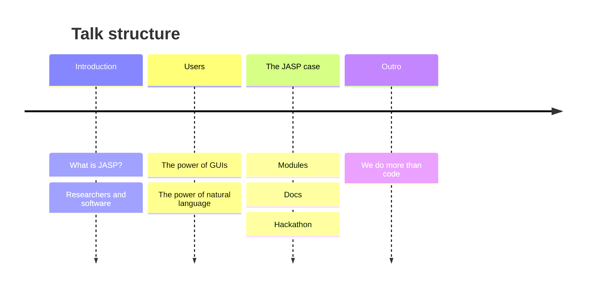
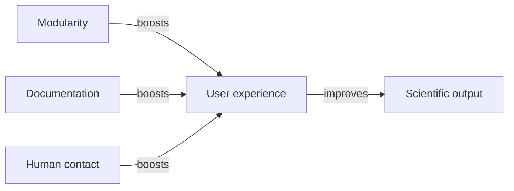

<!-- slide bg="https://github.com/PabRod/autodiff-slides/blob/main/_meta/_img/escience-cover.png?raw=true" -->
# JASP-MOD
## An adoption story

By Dr. Pablo Rodríguez-Sánchez

note: this will be invisible in the slide
### Mind map

---
## Before we start

[pabrod.github.io/today](https://pabrod.github.io/today.html)

---

## What is JASP?

--

## Researchers and software

--

--

--

---

## JASP modules

--

--

---

## JASP docs

--

--

--

---

## JASP hackathon(s)

--

--

---

#### Summarising

--

<!-- slide bg="https://github.com/PabRod/autodiff-slides/blob/main/_meta/_img/escience-cover.png?raw=true" -->
## Research software
### is a form of communication